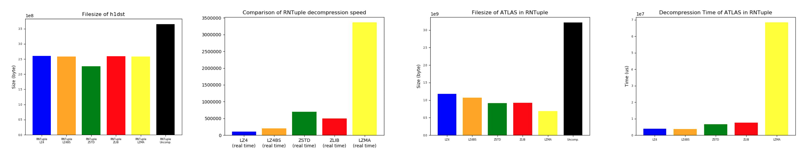

# GSoC 2020: Pre-conditioners applied to ROOT compression algorithms
https://summerofcode.withgoogle.com/projects/#5798059117641728

**Author**: [Keisuke Kamahori](https://github.com/kamahori)

**Organization**: [CERN-HSF](https://hepsoftwarefoundation.org)

**Mentors**: [Oksana Shadura](https://github.com/oshadura), [Brian Paul Bockelman](https://github.com/bbockelm), [Ken Bloom](https://github.com/kenbloom)

## Introduction
[ROOT](https://root.cern.ch/) is a set of C++ frameworks developed by CERN which provides all the functionality required to handle and analyze a large amount of data in a very efficient way. ROOT has become the de-facto standard tool in the field of high energy physics because of its flexibility: it can process any type of C++ object as machine-independent compressed formats such as [TTree](https://root.cern.ch/root/htmldoc/guides/users-guide/Trees.html) and [RNTuple](https://root.cern.ch/doc/master/md_tree_ntuple_v7_doc_README.html). 

In order to deal with the huge amounts of data, ROOT has an advanced I/O system that relies heavily on data compression to reduce the size of files. ROOT uses several compression algorithms such as [ZLIB](https://www.zlib.net/), [LZ4](https://github.com/lz4/lz4), or [ZSTD](https://github.com/facebook/zstd), and each has its own strong/weak points in terms of the two most important factors: compression ratio and decompression speed.

A pre-conditioner is an algorithm that rearranges binary data in order to improve the performance of compression algorithms. [Research](https://arxiv.org/abs/1906.04624) in 2019 demonstrated that [Bitshuffle](https://github.com/kiyo-masui/bitshuffle), a pre-conditioner that transposes binary data, can be beneficial for ROOT file formats. Bitshuffle does not compress data in itself but combined with LZ4 it performs better compression ratio.

This project has been focused on validating the possibility of using Bitshuffle in compressing ROOT files (TTree and RNTuple) and investigating how and when we can make use of the functionality.

## Integration
Prior to the coding period, I wrote a unit test as an exercise: [PR #5081](https://github.com/root-project/root/pull/5081).

Bitshuffle was integrated as a pre-conditioner for LZ4 as a new compression algorithm **LZ4BS** in [PR #6221](https://github.com/root-project/root/pull/6221). It can be used with the compression setting `6`.

To make the most of Bitshuffle, LZ4BS takes a comparison approach: when LZ4BS was chosen as the compression algorithm, it tries compressing both with LZ4/LZ4BS, then choose better one. Also, vectorization (SSE and AVX) was implemented like a fat binary.

### Benchmarks
I have also added some new I/O benchmarks to rootbench. For TTree, benchmarks for LHCb, NanoAOD, and ATLAS files were integrated in [PR #145](https://github.com/root-project/rootbench/pull/145) and [PR #179](https://github.com/root-project/rootbench/pull/179).
For RNTuple, ATLAS benchmark was added in [PR #170](https://github.com/root-project/rootbench/pull/170).

## Performance Analysis
Here I briefly summarize some of the performance analysis that I reported on the [final presentation](https://indico.cern.ch/event/877200/).

### TTree
LZ4BS made the compression ratio better for LHCb and NanoAOD files. Especially it worked pretty well for the NanoAOD file and it reduced decompression time. However, no improvement was seen for the ATLAS file (which is known to have a bad performance with LZ4).

### RNTuple
LZ4BS also improved the performance for RNTuple files.

### Compression Time
The time required in compressing files with LZ4BS was at most about 30% longer than with LZ4, which could be seen as reasonable considering the big improvement in the compression ratio.
| File/Level | LZ4 (ms) | LZ4BS (ms) | Ratio |
| :---: | :---: | :---: | :---: |
| LHCb/1 | 1221.56 | 1400.14 | +14.6% |
| LHCb/6 | 16639.5 | 22145.5 | **+33.1%** |
| LHCb/9 | 20609.3 | 27557.8 | **+33.7%** |
| NanoAOD/1 | 13692.0 | 15140.3 | +10.6% |
| NanoAOD/6 | 382049 | 437289 | +14.5% |
| NanoAOD/9 | 548143 | 549916 | +0.3% |

### Detailed Analysis
Branches (or pages for RNTuple) that consist only of small & positive `int` values have a good compression ratio in LZ4BS because there are many consecutive zeros after transposing such data.

On the other hand, `float` and `bool` values tend to have worse compression ratio than `int` values as shown in the table below, possibly because adjacent bytes are unlikely to correlate for such data types.
| Type | Total Size in LZ4 | Total Size in LZ4BS | Ratio |
| :---: | :---: | :---: | :---: |
| int | 216550264 | 78717632 | **-63.7%** |
| float | 4032419451 | 3198921162 | -21.7% |
| bool | 270378042 | 216623912 | -20.0% |

### ZSTD + Bitshuffle
Besides LZ4, Bitshuffle was tested along with ZSTD, but it did not result in the improvement of performance. As shown in this table, Bitshuffle reduced filesize with ZSTD only 5% even in the best scenario.
| File | Size in ZSTD | Size in ZSTD+BS | Ratio |
| :---: | :---: | :---: | :---: |
| LHCb | 120601097 | 114500217 |-5.1% |
| NanoAOD | 1588405426 | 1623656639 | +2.2% |
| ATLAS (TTree) | 1981475287 | 1980677449 | -0.0% |
| ATLAS (RNTuple) | 912145794 | 912145643 | -0.0% |

## Community
I had several opportunities to participate in ROOT I/O Meetings and present my progress to community members. Here is the list of meetings that I attended:
- https://indico.cern.ch/event/877191/ 
- https://indico.cern.ch/event/877195/
- https://indico.cern.ch/event/877196/
- https://indico.cern.ch/event/877200/